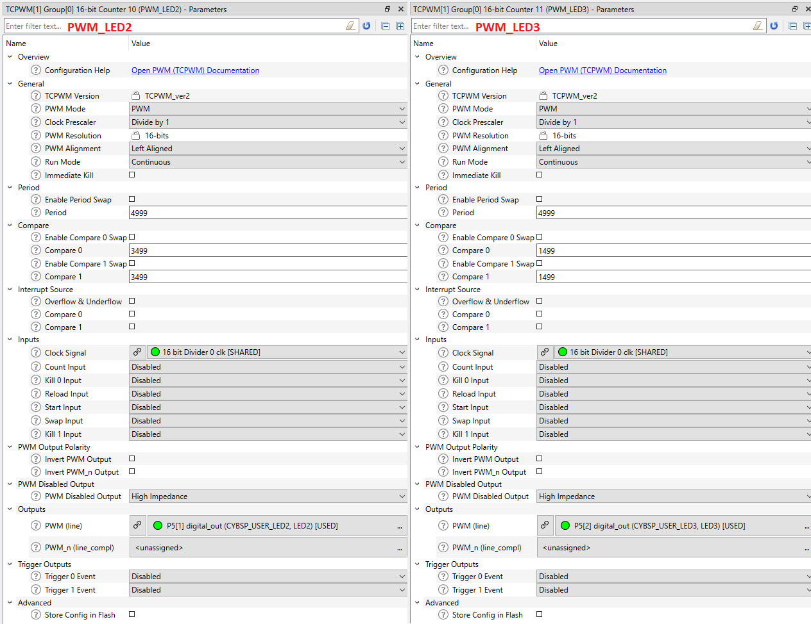
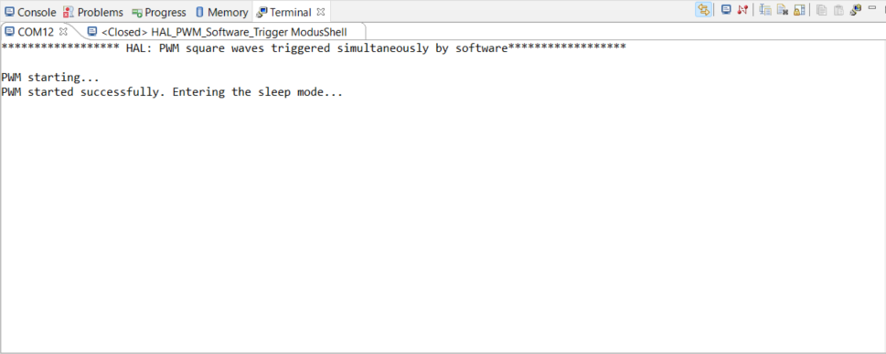
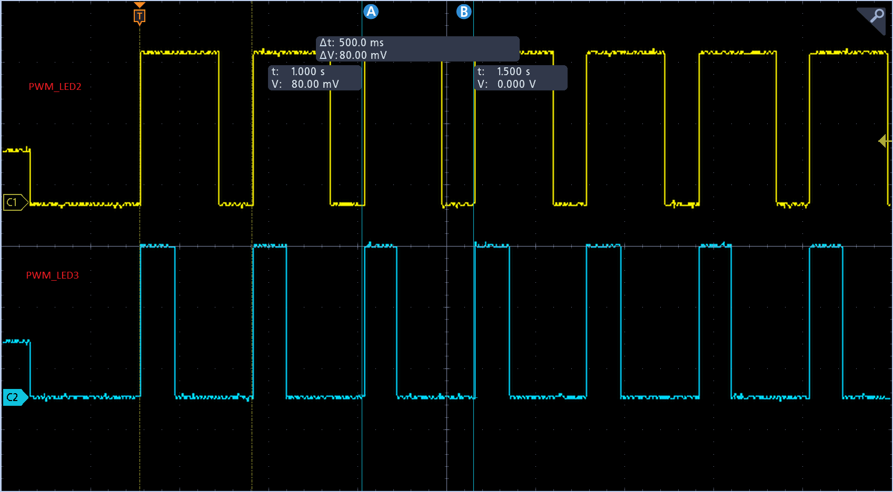

# Timer, Counter and PWM (TCPWM) Simultaneous Startup by Software Trigger

**This code example demonstrates how to trigger multiple TCPWM channels simultaneously by software.**

## Device

The device used in this code example (CE) is:

- [TRAVEO™ T2G CYT4BF Series](https://www.infineon.com/cms/en/product/microcontroller/32-bit-traveo-t2g-arm-cortex-microcontroller/32-bit-traveo-t2g-arm-cortex-for-body/traveo-t2g-cyt4bf-series/)

## Board

The board used for testing is:

- TRAVEO™ T2G evaluation kit ([KIT_T2G-B-H_EVK](https://www.infineon.com/cms/en/product/evaluation-boards/kit_t2g-b-h_evk/), [KIT_T2G-B-H_LITE](https://www.infineon.com/cms/en/product/evaluation-boards/kit_t2g-b-h_lite/))

## Scope of work

In this example, the LED-A and LED-B on the target board connected to the PWM output pin and blink at the rate of 2Hz with different duty cycles. These PWMs are made by TCPWM (Timer, Counter, and PWM) and simultaneously activated by software via Trigger Multiplexer.

## Introduction  

**TCPWM**  

The TCPWM block consists of 16-bit (102 channels) and 32-bit (16 channels) counters with user-programmable period. Fifteen of the 16-bit counters are optimized for motor-control operations. Each TCPWM counter contains a capture register to record the count at the time of an event, a period register (used to either stop or auto-reload the counter when its count is equal to the period register), and compare registers to generate signals that are used as PWM duty-cycle outputs.
 
- Up to 102 16-bit and 16 32-bit Timer/Counter Pulse-Width Modulator (TCPWM) blocks
    - Up to 15 16-bit counters for motor control
    - Up to 87 16-bit counters and 16 32-bit counters for regular operations
    - Supports timer, capture, quadrature decoding, pulse-width modulation (PWM), PWM with dead time (PWM_DT), pseudo-random PWM (PWM_PR), and shift-register (SR) modes.

**Trigger Multiplexer**

The Trigger Multiplexer supports connecting various peripherals using trigger signals. Triggers are used to inform a peripheral of the occurrence of an event or change of state. These triggers are used to affect or initiate some action in other peripherals. The trigger multiplexer is used to route triggers from a source peripheral to a destination. Triggers provide active logic functionality and are typically supported in Active mode.

- Ability to connect any trigger signal from one peripheral to another
- Provides up to 16 multiplexer-based trigger groups and up to 16 one-to-one trigger groups
- Supports a software trigger, which can trigger any signal in the block
- Ability to configure a trigger multiplexer with trigger manipulation features in hardware such as inversion and edge/level detection

More details can be found in [Technical Reference Manual (TRM)](https://www.infineon.com/dgdl/?fileId=5546d4627600a6bc017600bfae720007), [Registers TRM](https://www.infineon.com/dgdl/?fileId=5546d4627600a6bc017600be2aef0004) and [Data Sheet](https://www.infineon.com/dgdl/?fileId=5546d46275b79adb0175dc8387f93228).

## Hardware setup

This CE has been developed for:

- TRAVEO™ T2G evaluation kit ([KIT_T2G-B-H_EVK](https://www.infineon.com/cms/en/product/evaluation-boards/kit_t2g-b-h_evk/)) 
 
No changes are required from the board's default settings. Output signals are output from the following pins respectively: 
    <table border="1" style="border-collapse: collapse">
    <thead><tr>
    <th>PWM_LEDA</th><th>PWM_LEDB</th></tr></thead>
    <tbody>
    <tr><td>P16[2] (LED2)</td><td>P16[1] (LED1)</td></tr>
    </tbody>
    </table>
 
- TRAVEO™ T2G Body High Lite evaluation kit ([KIT_T2G-B-H_LITE](https://www.infineon.com/cms/en/product/evaluation-boards/kit_t2g-b-h_lite/)) 
 
No changes are required from the board's default settings. Output signals are output from the following pins respectively: 
    <table border="1" style="border-collapse: collapse">
    <thead><tr>
    <th>PWM_LEDA</th><th>PWM_LEDB</th></tr></thead>
    <tbody>
    <tr><td>P5[1] (LED2)</td><td>P5[2] (LED3)</td></tr>
    </tbody>
    </table>

## Implementation

**TCPWM waveform**

The PWM waves are configured to produce a 2-Hz PWM output. In this example, the output duty cycle is set to 70% for PWM_LEDA and 30% for PWM_LEDB, which generates a square wave. The output of the PWM_LEDA and PWM_LEDB are connected to LEDs that blinks at 500 ms (inverse of the PWM output frequency, 2 Hz). The configuration is done in a custom design.modus file. This can be opened by Device Configurator, also can be modified. If saved, all settings will be reflected to codes.
    
To vary the frequency and duty cycle of the PWM outputs, change the parameter on Device Configurator then rebuild and program the application. Observe the change in LED blink pattern.

- **Initialize and enable the TCPWM**
    - The configuration of each channels is output as *PWM_LEDA_config* and *PWM_LEDB_config* respectively. First, configure the *.startInput* and *.startInputMode* to get triggered by group trigger of Trigger Multiplexer.
    - Initialization of the TCPWM is done once in the <a href="https://infineon.github.io/mtb-pdl-cat1/pdl_api_reference_manual/html/group__group__tcpwm__functions__pwm.html#ga6440d2a9dc8d85056abd62556bee7f82"><i>Cy_TCPWM_PWM_Init()</i></a> function, then enables the TCPWM in the <a href="https://infineon.github.io/mtb-pdl-cat1/pdl_api_reference_manual/html/group__group__tcpwm__functions__pwm.html#ga802ebf3a49b1056e4bc5b057deb26e49"><i>Cy_TCPWM_PWM_Enable()</i></a> function. Note that the TCPWM operation clock starts at this point; if the TCPWM clock is set to divide the source clock, each channel starts operating at this timing, so even if simultaneous startup is performed by Trigger Multiplexer, the output PWM waveforms may not start same time.
- **Start the PWM**
    - Starts both the TCPWM channel simultaneously in the <a href="https://infineon.github.io/mtb-pdl-cat1/pdl_api_reference_manual/html/group__group__tcpwm__functions__common.html#gaafe86ec440bec9a2c23392f289cc3a8b"><i>Cy_TCPWM_TriggerStart_Single()</i></a> function

**Miscellaneous settings**  

- **STDIN / STDOUT setting**

  - Calling <a href="https://infineon.github.io/retarget-io/html/group__group__board__libs.html#ga21265301bf6e9239845227c2aead9293"><i>cy_retarget_io_init()</i></a> function to use UART as STDIN / STDOUT
    - Initialize the port defined as *CYBSP_DEBUG_UART_TX* as UART TX, defined as *CYBSP_DEBUG_UART_RX* as UART RX (these pins are connected to KitProg3 COM port)
    - The serial port parameters become to 8N1 and 115200 baud

## Run and Test

For this CE, a terminal emulator is required for displaying outputs and get inputs. Install a terminal emulator if you do not have one. Instructions in this document use [Tera Term](https://ttssh2.osdn.jp/index.html.en).

After code compilation, perform the following steps to flashing the device:

1. Connect the board to your PC using the provided USB cable through the KitProg3 USB connector.
2. Open a terminal program and select the KitProg3 COM port. Set the serial port parameters to 8N1 and 115200 baud.
3. Program the board using one of the following:
    - Select the CE project in the Project Explorer.
    - In the **Quick Panel**, scroll down, and click **[Project Name] Program (KitProg3_MiniProg4)**.
4. After programming, the CE starts automatically. Confirm that the messages are displayed on the UART terminal.

    - *Terminal output on program startup* 
5. The waveform that can be observed by the probe will be as follows, and the rising edges of both channels should be at the same timing:
    - *PWM_LEDA and PWM_LEDB*  
      
6. You can debug the example to step through the code. In the IDE, use the **[Project Name] Debug (KitProg3_MiniProg4)** configuration in the **Quick Panel**. For details, see the "Program and debug" section in the [Eclipse IDE for ModusToolbox™ software user guide](https://www.infineon.com/dgdl/?fileId=8ac78c8c8386267f0183a8d7043b58ee).

**Note:** **(Only while debugging)** On the CM7 CPU, some code in *main()* may execute before the debugger halts at the beginning of *main()*. This means that some code executes twice: once before the debugger stops execution, and again after the debugger resets the program counter to the beginning of *main()*. See [KBA231071](https://community.infineon.com/t5/Knowledge-Base-Articles/PSoC-6-MCU-Code-in-main-executes-before-the-debugger-halts-at-the-first-line-of/ta-p/253856) to learn about this and for the workaround.

## References  

Relevant Application notes are:

- AN235305 - GETTING STARTED WITH TRAVEO™ T2G FAMILY MCUS IN MODUSTOOLBOX™
- [AN220224](https://www.infineon.com/dgdl/?fileId=8ac78c8c7cdc391c017d0d3a800a6752) - How to Use Timer, Counter, and PWM (TCPWM) in TRAVEO™ II Family
- [AN228104](https://www.infineon.com/dgdl/?fileId=5546d4627883d7e00178ab0f5057708c) - How to Use Trigger Multiplexer in TRAVEO™ II family
- [AN224434](https://www.infineon.com/dgdl/?fileId=8ac78c8c7cdc391c017d0d3a71ec674a) - Clock configuration setup in TRAVEO™ T2G family CYT4B series

ModusToolbox™ is available online:
- <https://www.infineon.com/modustoolbox>

Associated TRAVEO™ T2G MCUs can be found on:
- <https://www.infineon.com/cms/en/product/microcontroller/32-bit-traveo-t2g-arm-cortex-microcontroller/>

More code examples can be found on the GIT repository:
- [TRAVEO™ T2G Code examples](https://github.com/orgs/Infineon/repositories?q=mtb-t2g-&type=all&language=&sort=)

For additional trainings, visit our webpage:  
- [TRAVEO™ T2G trainings](https://www.infineon.com/cms/en/product/microcontroller/32-bit-traveo-t2g-arm-cortex-microcontroller/32-bit-traveo-t2g-arm-cortex-for-body/traveo-t2g-cyt4bf-series/#!trainings)

For questions and support, use the TRAVEO™ T2G Forum:  
- <https://community.infineon.com/t5/TRAVEO-T2G/bd-p/TraveoII>  
